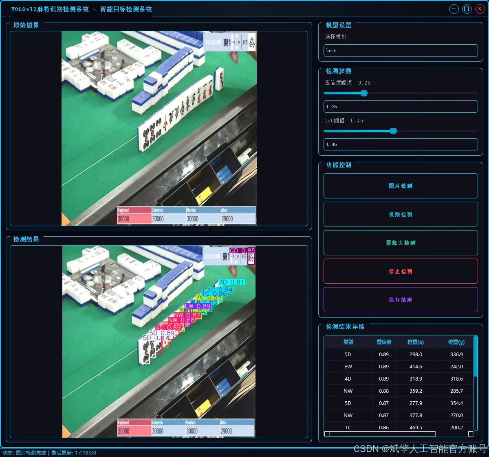
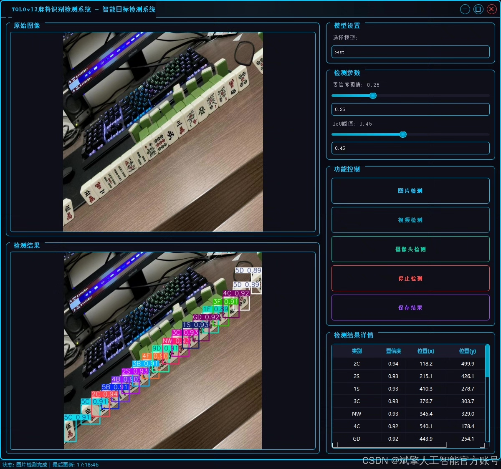
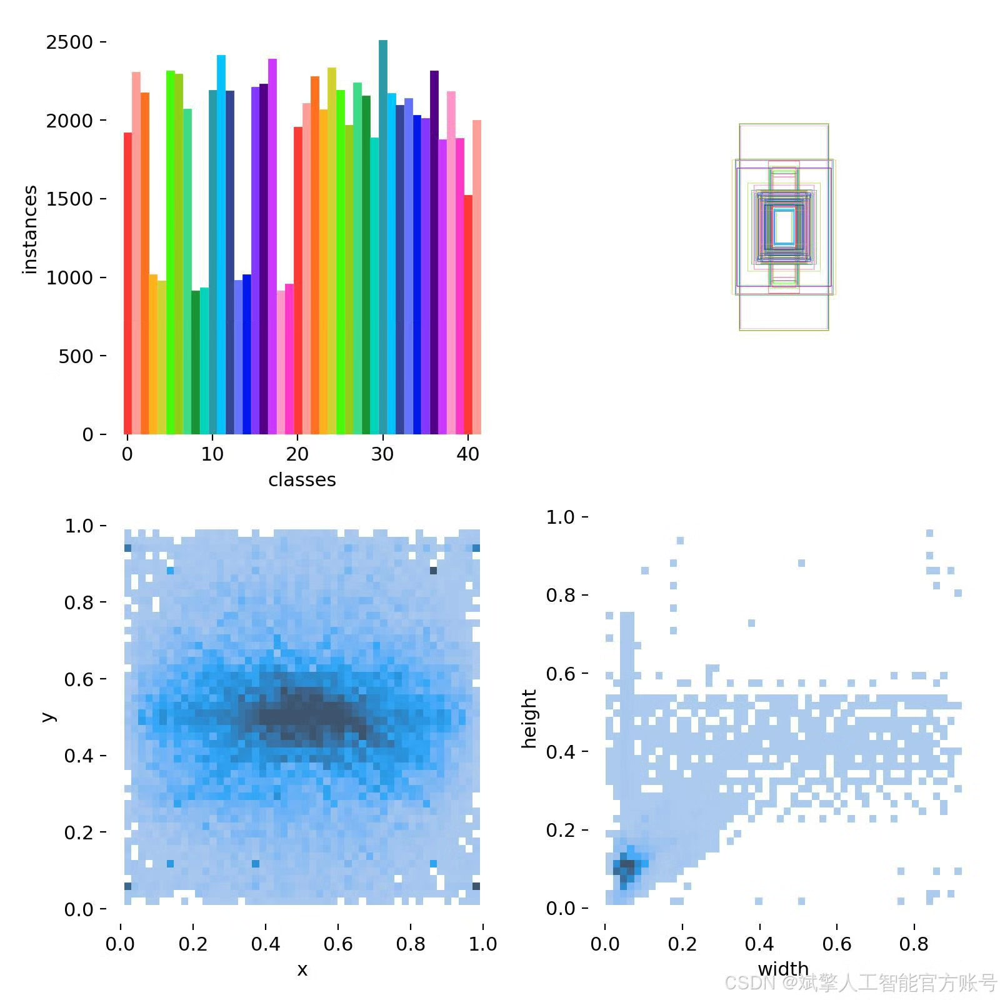
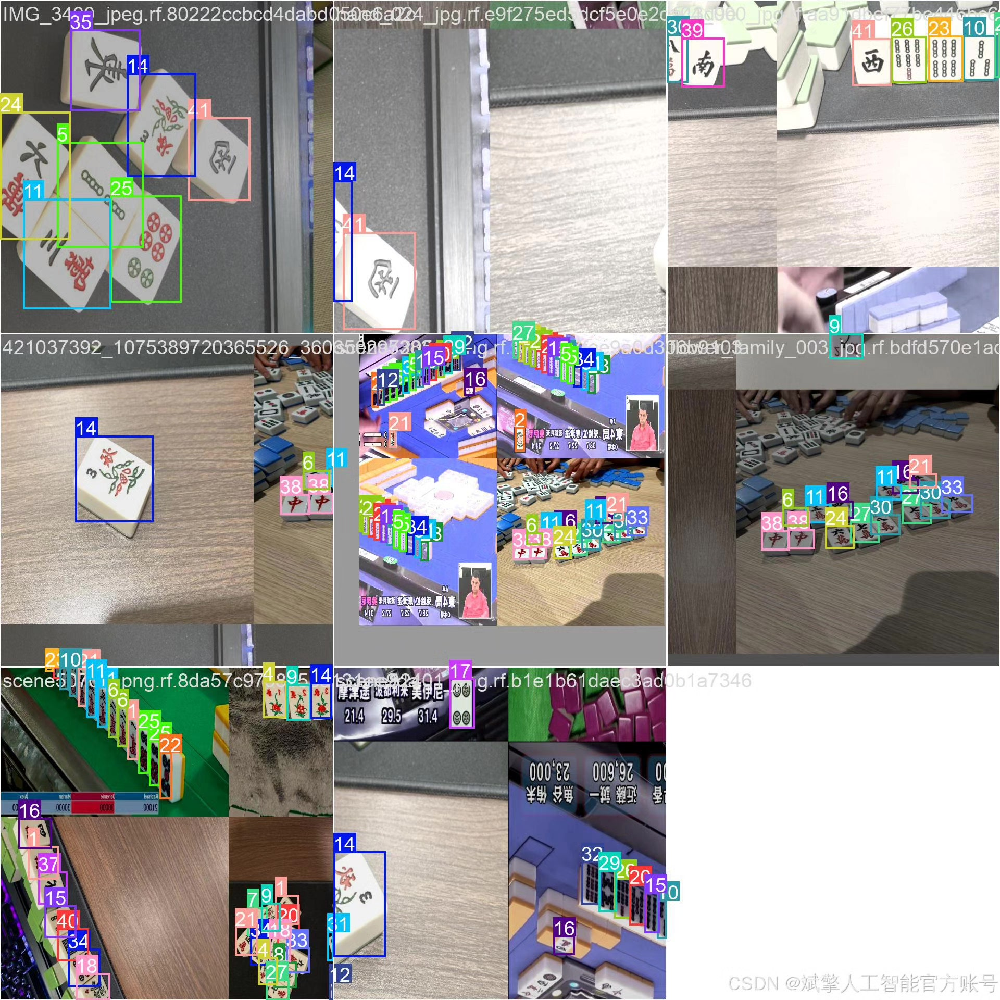
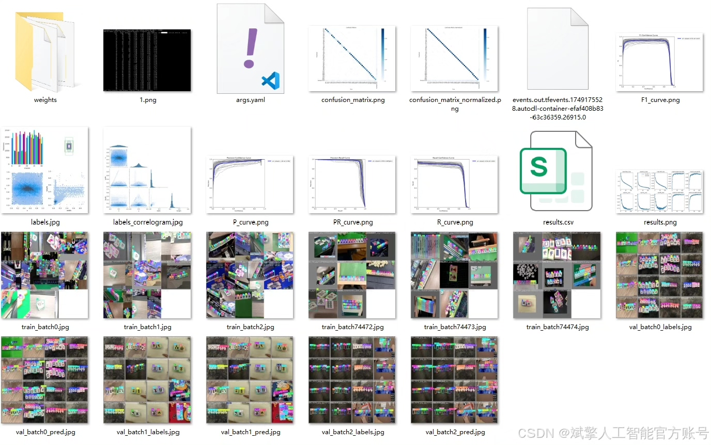
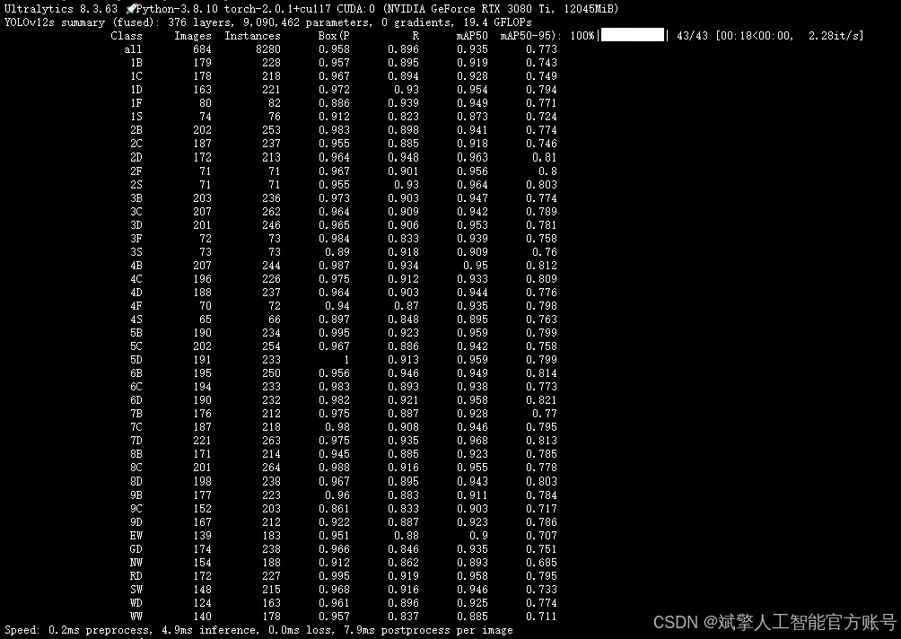
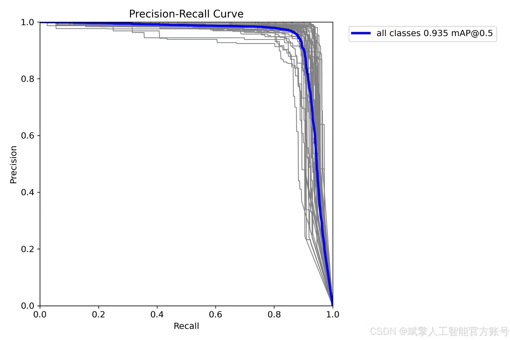
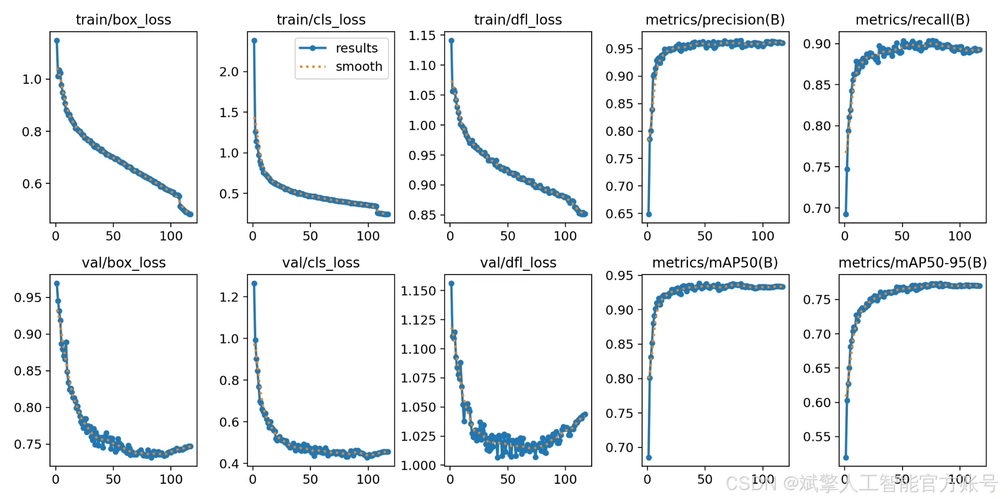
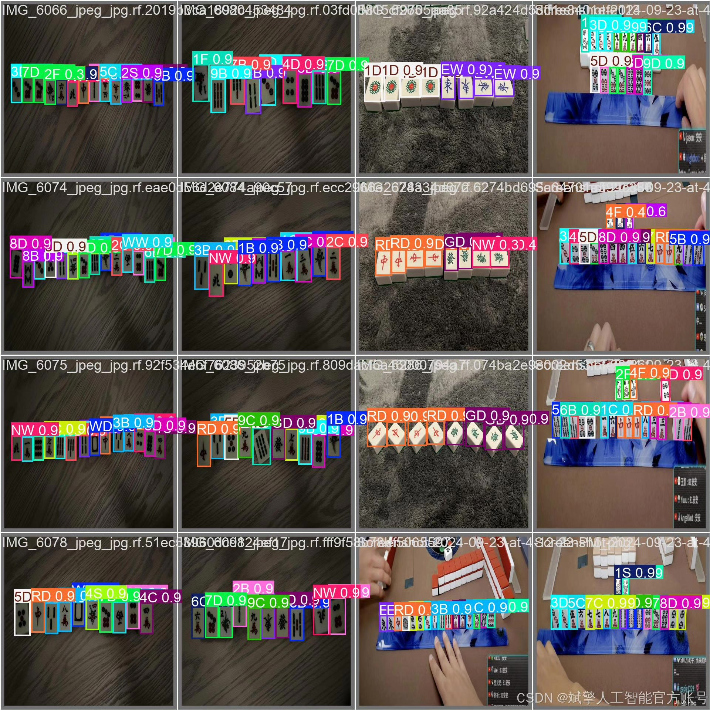

# YOLOv12 Mahjong Recognition System

## Body

YOLOv12 Mahogany Recognition System Based on Deep Learning YOLOv12: A Mahogany Card Recognition and Detection System (YOLOv12+YOLO dataset + UI interface + login/registration interface + Python project source code + model)

This paper proposes a mahogany card intelligent recognition system based on the YOLOv12 deep learning framework. It achieves high-precision recognition of 34 basic types and 8 special types (totaling 42 categories) through an improved target detection algorithm. The system employs a large-scale mahogany dataset independently constructed (including 6,731 labeled images, with 5,565 training sets, 684 validation sets, and 482 test sets). Experiments show that the system achieves an mAP@0.5 of 93.5% on the test set, with a single-frame inference speed reaching 83FPS. Innovatively integrating user authentication (UI login/registration interface) and real-time detection functions, the project includes complete Python implementation code, pre-trained models, and labeled datasets.

✅ User Login/Registration: Supports password verification and security validation.
✅ Three detection modes: Based on the YOLOv12 model, supports image, video, and real-time camera detection for precise target recognition.
✅ Dual-screen comparison: Display original images and detection results simultaneously on the screen.
✅ Data visualization: Real-time table displaying the category, confidence, and coordinates of detected targets.
✅ Intelligent parameter adjustment: Offers a confidence slide bar to dynamically optimize detection accuracy, adapting to different scene requirements.
✅ Sci-fi style interactive interface: Dark theme combined with dynamic light effects, reducing visual fatigue and enhancing operational experience.

## Images

## Payment

Here is a pay link on Stripe ( https://buy.stripe.com/3cs8yP7sY87d0vu9AB ). Please contact me lonlonago@foxmail.com after funding $89, and I will send you a complete data files , thank you!

